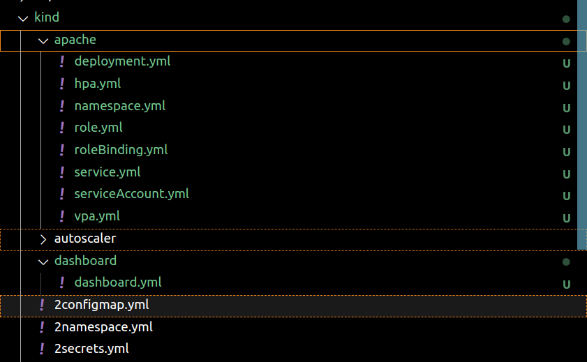
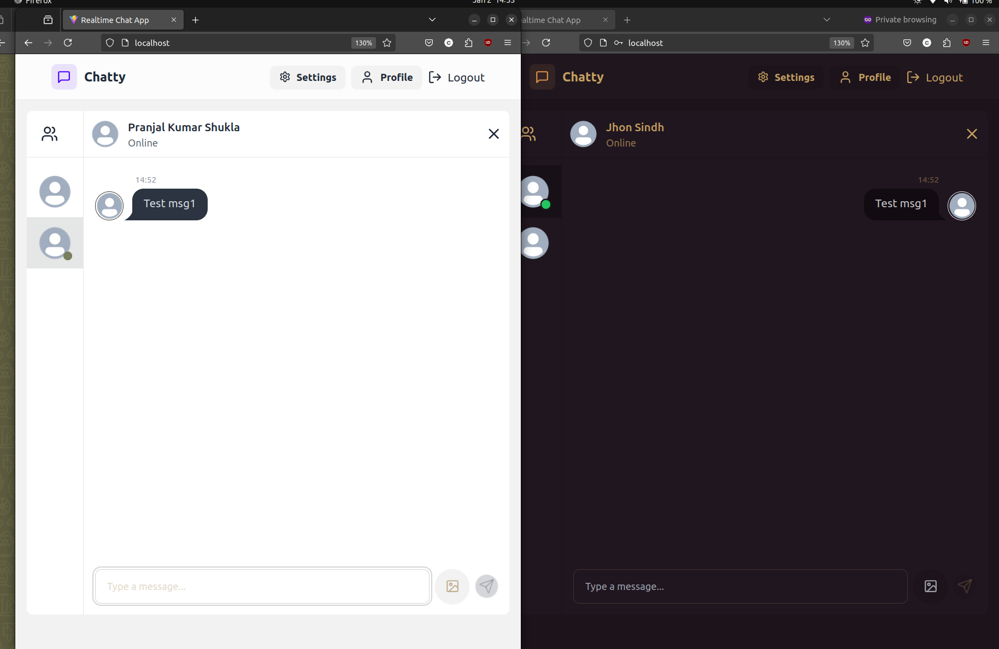
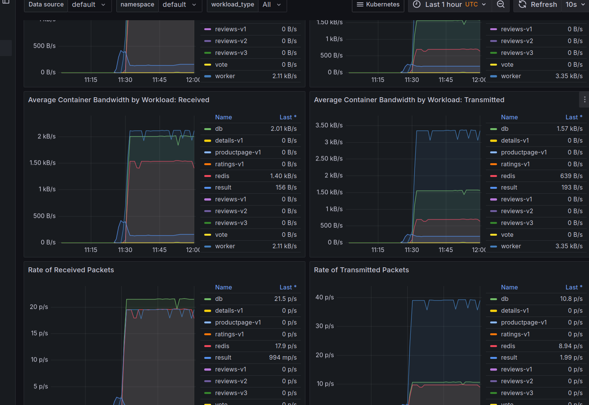

# K8S Project

This repository demonstrates the use of **Kubernetes (K8S)** for managing a variety of applications and services. The project includes several applications that are deployed on Kubernetes using resources such as deployments, services, secrets, configmaps, and more. This project showcases best practices for setting up a Kubernetes environment, working with `kind` (Kubernetes in Docker), and orchestrating applications in a microservices architecture.

## **Tech Stack:**
- **Kubernetes (K8S)**
- **Helm (optional, for chart management)**
- **Docker** (for containerization)
- **Autoscaler**


## **Applied on these projects:**
- **MongoDB**
- **Redis**
- **Frontend (React/Angular)**
- **Kind (Kubernetes in Docker)**
- **Backend (Node.js, Express)**
- **Grafana (for monitoring)**
- **Apache**
- **Prometheus (for monitoring)**

## **Applications:**
This project includes three main applications, each with its own Kubernetes configurations:

1. **Chat Application (Full-Stack)**
   - Frontend and backend deployed as separate services.
   - MongoDB as the database.
   - Ingress configured for external access.

2. **Voting App (Monitoring Example)**
   - A voting app demonstrating multiple services (Vote, Result, Redis, DB).
   - Used for monitoring with Grafana and Prometheus.

---

## **K8S Resources Overview:**

The project uses a variety of Kubernetes resources to deploy and manage applications. These resources are described below:

### **Kind Cluster Setup**
- **kind/apache**: Apache setup using kind.
- **kind/autoscaler**: Autoscaler configuration for automatic scaling of services based on usage.
- **kind/dashboard**: Kubernetes dashboard for cluster management and monitoring.

### **Core Kubernetes Resources**:


These files define essential Kubernetes resources for each application.

- **kind/2configmap.yml**: ConfigMap for managing configuration data.
- **kind/2namespace.yml**: Namespace configuration to isolate resources.
- **kind/2secrets.yml**: Secrets management for sensitive data.
- **kind/2service.yml**: A generic service definition.
- **kind/config1.yml**: Generic configuration file for resource setup.
- **kind/cron-job.yml**: Cron job configuration for scheduled tasks.
- **kind/daemonset.yml**: DaemonSet for running a pod on each node in the cluster.
- **kind/deployment.yml**: Deployment configuration for managing replica sets.
- **kind/ingress.yml**: Ingress configuration for routing external traffic to services.
- **kind/job.yml**: Job configuration for running a batch job.
- **kind/namespace.yml**: Namespace creation for resource isolation.
- **kind/persistent_volume.yml**: Persistent Volume configuration for storage.
- **kind/pod.yml**: Pod definition to run containerized applications.
- **kind/pvc.yml**: Persistent Volume Claim for storage requests.
- **kind/replicaset.yml**: ReplicaSet for scaling the number of pods.
- **kind/service.yml**: Service to expose pods to network traffic.

### **Full-Stack Chat Application Kubernetes Files**:


These configurations deploy a full-stack chat application (React + Node.js + MongoDB) on Kubernetes.

- **full-stack_chatApp/k8s/backend-deployment.yml**: Backend service deployment.
- **full-stack_chatApp/k8s/backend-service.yml**: Backend service for exposing the API.
- **full-stack_chatApp/k8s/frontend-deployment.yml**: Frontend service deployment.
- **full-stack_chatApp/k8s/frontend-service.yml**: Frontend service for exposing the web UI.
- **full-stack_chatApp/k8s/ingress_deployment.yml**: Ingress controller for routing traffic to the app.
- **full-stack_chatApp/k8s/mongodb-deployment.yml**: MongoDB deployment for database services.
- **full-stack_chatApp/k8s/mongodb-pv.yml**: Persistent volume for MongoDB storage.
- **full-stack_chatApp/k8s/mongodb-pvc.yml**: Persistent volume claim for MongoDB.
- **full-stack_chatApp/k8s/mongodb-service.yml**: Service to expose the MongoDB database.
- **full-stack_chatApp/k8s/namespace.yml**: Namespace configuration for isolation.
- **full-stack_chatApp/k8s/secret.yml**: Secrets for secure data handling (e.g., database passwords).

### **Voting App (Monitoring) Kubernetes Files**:

These files define the Kubernetes configurations for a simple voting application with a backend database and Redis for caching.

- **k8s-kind-voting-app/k8s-specifications/db-deployment.yaml**: DB deployment for the voting app.
- **k8s-kind-voting-app/k8s-specifications/db-service.yaml**: DB service for exposing the database.
- **k8s-kind-voting-app/k8s-specifications/redis-deployment.yaml**: Redis deployment for the voting app cache.
- **k8s-kind-voting-app/k8s-specifications/redis-service.yaml**: Redis service for exposing Redis.
- **k8s-kind-voting-app/k8s-specifications/result-deployment.yaml**: Result service deployment for the app.
- **k8s-kind-voting-app/k8s-specifications/result-service.yaml**: Result service for exposing result API.
- **k8s-kind-voting-app/k8s-specifications/vote-deployment.yaml**: Vote service deployment.
- **k8s-kind-voting-app/k8s-specifications/vote-service.yaml**: Vote service for exposing the vote API.

---

## **Monitoring and Visualization (Grafana)**:
The project also integrates **Grafana** for monitoring the Kubernetes cluster and applications. Grafana is configured to work with **Prometheus** as the data source to visualize metrics from your applications.

---

## **How to Run the Project**:

1. **Set Up Kind Cluster**: 
   - Install `kind` (Kubernetes in Docker) on your machine.
   - Create a Kubernetes cluster using the following command:
     ```bash
     kind create cluster --name k8s-cluster
     ```

2. **Apply Kubernetes Configurations**:
   - Navigate to the `k8s` directory for the respective application and apply the YAML files:
     ```bash
     kubectl apply -f kind/
     kubectl apply -f full-stack_chatApp/k8s/
     kubectl apply -f k8s-kind-voting-app/k8s-specifications/
     ```

3. **Access the Services**:
   - You can access services (like the chat app and voting app) through the Kubernetes Ingress or by exposing services via LoadBalancer/NodePort depending on your setup.

4. **Monitoring**:
   - Set up **Prometheus** and **Grafana** for monitoring the performance and metrics of your Kubernetes resources.

---

## **Contributing**:

We welcome contributions! If you have suggestions or improvements for this project, please feel free to fork the repository and submit a pull request. Here's how you can contribute:

1. **Fork the repository**
2. **Clone your fork**:
   ```bash
   git clone https://github.com/PranjalKumar09/K8s_project.git
   ```
3. **Create a branch**:
   ```bash
   git checkout -b kr-feature
   ```
4. **Make your changes** and commit them.
5. **Push to your fork**:
   ```bash
   git push origin your-feature-branch
   ```
6. **Open a Pull Request**.

---

## **License**:
This project is licensed under the Apache License - see the [LICENSE](LICENSE) file for details.
